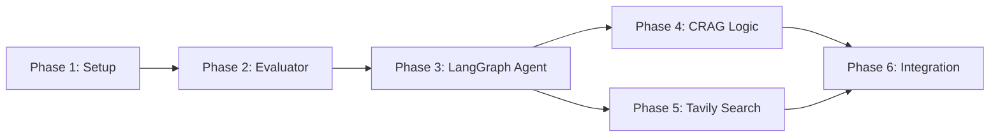

# Agentic RAG Implementation Plan

This folder contains the complete implementation plan for **Self-Reflective Agentic RAG** (Corrective RAG with LangGraph), following Test-Driven Development (TDD) methodology.

## 📋 Quick Navigation

| Phase | Document | Status | Description |
|-------|----------|--------|-------------|
| Overview | [00-overview.md](00-overview.md) | 📘 | Project context, goals, and phase summary |
| Phase 1 | [01-setup-and-dependencies.md](01-setup-and-dependencies.md) | 🔧 | Project setup, dependencies, test scaffolding |
| Phase 2 | [02-retrieval-evaluator.md](02-retrieval-evaluator.md) | 🎯 | Document relevance evaluation component |
| Phase 3 | [03-langgraph-agent-state.md](03-langgraph-agent-state.md) | 🤖 | LangGraph state machine and orchestration |
| Phase 4 | [04-corrective-rag-logic.md](04-corrective-rag-logic.md) | 🔄 | CRAG techniques and self-correction |
| Phase 5 | [05-tavily-search-integration.md](05-tavily-search-integration.md) | 🔍 | Tavily search integration |
| Phase 6 | [06-integration-and-optimization.md](06-integration-and-optimization.md) | ✅ | Full integration and optimization |

## 🎯 Goal

Implement a RAG system using **LangGraph** that:
- ✅ Evaluates the relevance of retrieved documents
- ✅ Decides autonomously whether to search again or rely on the LLM
- ✅ Incorporates **CRAG (Corrective RAG)** techniques for hallucination reduction
- ✅ Builds self-correcting autonomous agents

## 🏗️ Architecture Overview

```
User Query → LangGraph Agent → [Retrieve] → [Evaluate] → [Generate] → [Validate] → Answer
                         ↑                                      ↓
                         └────── [Re-search/Correct] ←──────────┘
```

## 📚 Key Components

1. **Relevance Evaluator** - Assesses document quality
2. **LangGraph Agent** - Orchestrates workflow with state management
3. **Answer Validator** - Detects hallucinations
4. **Correction Engine** - Self-corrects mistakes
5. **Tavily Search** - External knowledge retrieval
6. **Hybrid Retriever** - Combines local + web search

## 🧪 TDD Methodology

This implementation strictly follows **Test-Driven Development**:

1. **Red** - Write failing tests first
2. **Green** - Implement minimum code to pass tests
3. **Refactor** - Improve code while keeping tests green

Each phase includes:
- Test scaffolding/structure
- Implementation guidelines
- Pseudo code for critical paths
- Success criteria

## 📁 Target Directory Structure

```
src/
├── conversational_rag/     # Existing RAG chain
├── agentic_rag/            # New Agentic RAG module
│   ├── __init__.py           # Public API
│   ├── __init__.py           # Package init
│   ├── config.py             # Configuration management
│   ├── factory.py            # Factory functions
│   ├── state.py              # LangGraph state definitions
│   ├── evaluator.py          # Document relevance evaluator
│   ├── agent.py              # Main agent orchestration
│   ├── corrective.py         # CRAG logic (validation & correction)
│   └── search.py             # Tavily search integration
└── conversational_rag/rag_chain.py  # Reference to existing RAG chain

test/
├── agentic_rag/
│   ├── __init__.py
│   ├── test_config.py
│   ├── test_state.py
├── test_evaluator.py
├── test_agent.py
├── test_corrective.py
├── test_search.py
├── test_integration.py       # Integration tests
└── test_benchmarks.py        # Performance benchmarks
```

## 🚀 Implementation Order

Follow phases **in order** - each builds on previous phases:



## 📊 Success Metrics

| Metric | Target |
|--------|--------|
| Test Coverage | > 90% |
| P95 Latency | < 10s |
| Hallucination Rate | < 5% |
| Avg Searches/Query | < 1.5 |
| Quality Score | > 0.8 |

## 🛠️ Getting Started

### Prerequisites

- Python 3.13+
- Poetry (dependency management)
- Tavily API key
- OpenAI API key (or other LLM provider)

### Installation

```bash
# Install dependencies
poetry install --with dev

# Set up environment
export TAVILY_API_KEY="your_key_here"
export OPENAI_API_KEY="your_key_here"

# Run tests
make test-agentic
```

## 📖 Documentation

- **Main Concept**: See [`../../agentic_rag.md`](../../agentic_rag.md) for high-level overview
- **LangGraph Docs**: https://langchain-ai.github.io/langgraph/
- **Tavily Docs**: https://docs.tavily.com/
- **CRAG Research**: https://arxiv.org/abs/2401.15624

## 🔍 Key Learnings

This implementation teaches:
- Building autonomous agents with LangGraph
- Self-correction mechanisms for hallucination reduction
- Hybrid retrieval strategies (local + web)
- Test-driven development for AI systems
- Quality evaluation and metrics tracking

## 📝 Notes

- **No actual code** in this plan - only pseudo code for critical paths
- Each phase is self-contained and can be implemented independently
- Integration happens in Phase 6
- TDD ensures high code quality throughout

## 🤝 Contributing

When implementing:
1. Follow TDD strictly (tests first!)
2. Add comprehensive docstrings
3. Include type hints
4. Update this README with implementation notes
5. Add metrics and monitoring

## 📞 Support

For questions:
- Check test files for usage examples
- Review pseudo code in each phase document
- Refer to LangGraph and Tavily documentation

---

**Ready to implement?** Start with [Phase 1: Setup and Dependencies](01-setup-and-dependencies.md)!
